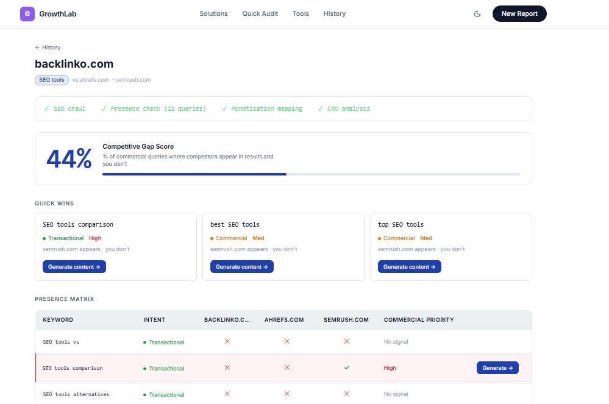
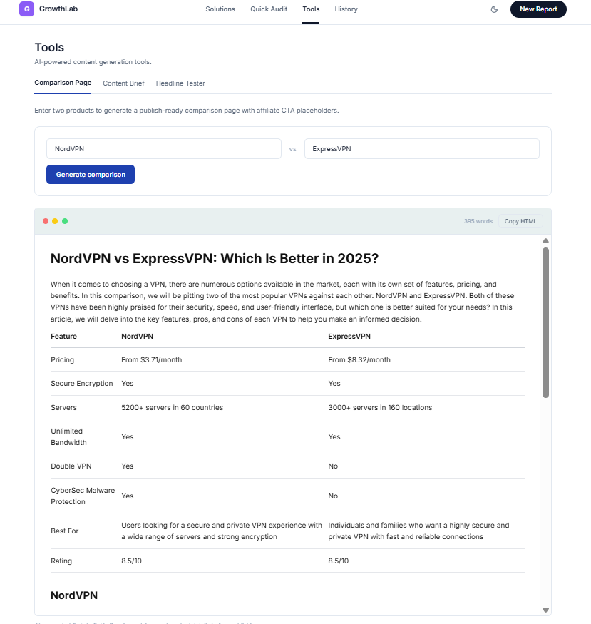

# GrowthLab

**Competitive growth intelligence for affiliate and content sites.**

GrowthLab is a competitive growth intelligence tool for affiliate and content sites.

Enter your site, up to two competitors, and a topic niche. GrowthLab runs four agents in parallel to audit SEO health, check search-result presence, map monetisation opportunities, and analyse conversion problems.

The core output is a presence matrix: a keyword × site grid showing where competitors appear and your site does not, scored by commercial priority. From any gap, you can generate editor-ready content drafts inline — comparison pages, content briefs, or headline variants. Reports can also be tracked, with presence checks re-run automatically every 24 hours.

**[Live Demo →](https://growthlab-rho.vercel.app)** | Built by [@trinayanswarup](https://github.com/trinayanswarup)

> **First run note:** Cold starts on Vercel's free tier may take 20–40 seconds
> for the first report. Subsequent reports are faster. Results stream in section
> by section as each agent completes — you don't wait for the full pipeline.

---

<div align="center">
  
  
  
</div>

---

## How it works

1. Enter your site, up to two competitors, and a topic niche
2. Four AI agents run in parallel — SEO crawl, SERP presence check, monetisation mapping, CRO analysis
3. A presence matrix shows which keywords competitors appear for and you don't
4. Click any gap → generate a content brief or comparison page inline
5. Track reports — presence checks re-run automatically every 24 hours via Vercel Cron

**Demo:** `backlinko.com` vs `ahrefs.com` vs `semrush.com`, topic: `SEO tools`

---

## Features

### Competitive Presence Matrix

Runs 12 Tavily search queries per report — a sampled set covering commercial, transactional, and informational intent. For each query, checks which of the three sites appear in results. Gap rows (target absent, at least one competitor present) are highlighted with commercial priority scoring.

**Important:** This uses Tavily as a lightweight SERP presence signal, not exact Google rankings or volume data. No search volumes, keyword difficulty scores, or CPC data are fabricated. In production, the same architecture could ingest Ahrefs, Semrush, or GSC data — the agent contracts stay the same.

### Four parallel AI agents

All agents run concurrently via `Promise.allSettled`. Each writes independently to Supabase. The frontend polls every 2 seconds and renders each section as it completes — no waiting for the full pipeline.

| Agent          | What it does                                                                  | Model              |
| -------------- | ----------------------------------------------------------------------------- | ------------------ |
| SEO Auditor    | Crawls top 5 pages, scores 0–100 on 7 factors                                 | Cheerio (no LLM)   |
| Presence Check | 12 Tavily queries, checks all 3 sites per query                               | Tavily API         |
| Monetisation   | Maps site topics to affiliate categories + commission rates                   | Groq llama-3.3-70b |
| CRO Analysis   | Checks 5 conversion factors: value prop, CTAs, social proof, trust, freshness | Groq llama-3.3-70b |

### Content generation

- **Comparison pages** — full editor-ready HTML draft: feature table, pros/cons, verdict, FAQ, affiliate CTA placeholders. Researched via Tavily, written by Gemini 2.0 Flash.
- **Content briefs** — title tag, meta, H2/H3 structure, word count, competitor analysis, secondary keywords, commissioning note for writers
- **Headline tester** — 5 AI-scored variants per goal (CTR, authority, curiosity, keyword, emotion). Combine best elements into one.

All generated outputs are labelled as first drafts. Verify claims, pricing, and product details before publishing.

### Scheduled re-audits

Mark any report as tracked. A Vercel Cron job re-runs presence checks every 24 hours and updates the opportunity score. Turns a one-shot tool into a monitoring product.

### Quick Audit

Single-URL audit without competitors. SEO scoring + keyword gap detection + inline brief generation. Useful for auditing your own site before running a competitive report.

---

## Tech stack

| Layer          | Choice                       | Why                                                              |
| -------------- | ---------------------------- | ---------------------------------------------------------------- |
| Framework      | Next.js 14 (App Router)      | Server components + API routes in one repo                       |
| Language       | TypeScript                   | Type safety across agents and API contracts                      |
| Database       | Supabase (Postgres)          | Free tier, real-time polling via REST                            |
| Crawling       | Cheerio                      | Deterministic SEO scoring without LLM cost or hallucination risk |
| Search         | Tavily API                   | Real SERP presence signal, free tier                             |
| Long-form LLM  | Gemini 2.0 Flash             | 1M context, free tier, comparison page research                  |
| Short-form LLM | Groq llama-3.3-70b           | Fast structured JSON, free tier                                  |
| Scheduling     | Vercel Cron                  | Daily re-audits, zero infrastructure                             |
| Deployment     | Vercel                       | Free Hobby plan                                                  |
| Styling        | Tailwind CSS + CSS variables | Dark/light toggle, semantic colour system                        |

**Free tier only.** No paid APIs, no credit card required to run.

---

## Architecture

```
POST /api/report
  └── runReportBackground()
        ├── Promise.allSettled([
        │     runSEOAudit(),          // Cheerio, no LLM
        │     buildPresenceMatrix()   // 12 Tavily searches in parallel
        │   ])
        └── Promise.allSettled([
              runMonetisationAgent(), // Groq
              runCROAgent()           // Groq
            ])

Frontend polls /api/reports/[id]/status every 2s
Each section renders independently as its agent completes
```

**Key engineering decisions:**

**Cheerio for SEO, not LLM** — SEO scoring is deterministic. Title length, H1 count, alt text presence — these have correct answers. Using an LLM introduces hallucination risk and cost for a problem that doesn't need one.

**Client-side polling over SSE** — simpler failure handling. Each agent fails independently. A broken CRO agent doesn't affect the presence matrix. The frontend stops polling when `status === 'done' || 'failed'`.

**No fabricated metrics** — presence = real Tavily SERP signal. Commercial priority = transparent heuristic based on intent classification. The UI labels it as such. Never "estimated 12,000 monthly searches."

**Supabase fetch cache fix** — Next.js patches the global `fetch` function and caches responses by default. Supabase uses fetch internally, so all DB reads were returning stale data. Fixed by passing `cache: 'no-store'` to the Supabase client's internal fetch on every call.

**Gemini → Groq fallback** — if Gemini hits the free tier quota (1500 req/day), `geminiComplete()` catches the 429 and falls back to Groq automatically. Output quality degrades slightly but the feature never breaks.

---

## How I build with AI agents

Every session starts with `CLAUDE-REPO.md` — a context file that teaches Claude Code the architecture, LLM routing decisions, hard constraints, and critical fixes before any code is written.

This mirrors how production AI-assisted engineering works: persistent context, explicit constraints, testable outputs, and human review. I define what to build and why, Claude Code executes, I review and own the output.

See `CLAUDE-REPO.md` for the full context file and `AGENTS-REPO.md` for the agent pipeline design.

---

## Validation

```bash
npm run lint        # ESLint
npm run build       # Next.js production build — must pass clean
```

Core correctness is enforced through TypeScript contracts across all agent inputs/outputs, API route validation, and production build checks. The SEO auditor is the only agent with fully deterministic logic — it's the strongest candidate for unit tests in a future pass.

---

## Local setup

```bash
git clone https://github.com/trinayanswarup/growthlab
cd growthlab
npm install
cp .env.example .env.local
# Fill in your API keys
npm run dev
```

### Environment variables

```env
NEXT_PUBLIC_SUPABASE_URL=
NEXT_PUBLIC_SUPABASE_ANON_KEY=
SUPABASE_SERVICE_ROLE_KEY=
TAVILY_API_KEY=
GEMINI_API_KEY=
GROQ_API_KEY=
CRON_SECRET=
```

All free tier. Get keys at:

- [supabase.com](https://supabase.com) — database
- [tavily.com](https://tavily.com) — search API (1000 req/month free)
- [aistudio.google.com](https://aistudio.google.com) — Gemini API
- [console.groq.com](https://console.groq.com) — Groq API

### Database setup

Run `supabase/schema.sql` in your Supabase SQL editor.

---

## API routes

| Route                            | Method | Description                             |
| -------------------------------- | ------ | --------------------------------------- |
| `/api/report`                    | POST   | Create report, fire background pipeline |
| `/api/reports/[id]/status`       | GET    | Poll agent completion status            |
| `/api/reports/[id]/matrix`       | GET    | Presence matrix rows                    |
| `/api/reports/[id]/seo`          | GET    | SEO audit pages                         |
| `/api/reports/[id]/monetisation` | GET    | Monetisation opportunities              |
| `/api/reports/[id]/cro`          | GET    | CRO analysis factors                    |
| `/api/reports/[id]/generate`     | POST   | Generate content brief inline           |
| `/api/reports/[id]/track`        | PATCH  | Toggle daily re-audit tracking          |
| `/api/reports/recent`            | GET    | Last 5 reports for homepage             |
| `/api/reports/history`           | GET    | Full report history                     |
| `/api/generate/comparison`       | POST   | Standalone comparison page              |
| `/api/generate/headline`         | POST   | Headline variants                       |
| `/api/generate/headline/combine` | POST   | Combine variants into one               |
| `/api/audit`                     | POST   | Quick audit (single URL)                |
| `/api/audits/[id]/status`        | GET    | Quick audit status                      |
| `/api/cron/reaudit`              | GET    | Daily cron — re-audits tracked reports  |

---

## Development notes

`CLAUDE.md` and `AGENTS.md` are excluded from this repository. The public
equivalents — `CLAUDE-REPO.md` and `AGENTS-REPO.md` — document the architecture,
agent specs, and engineering decisions for anyone reading the codebase.

The internal files contain session-by-session Claude Code prompts, Windows/PowerShell
quirks, mid-build debugging notes, and restore-point commit instructions. Useful
during a build sprint, noise to anyone reading the repo afterward.

If you're interested in how I structure AI-assisted development workflows,
`CLAUDE-REPO.md` covers the context engineering approach and `AGENTS-REPO.md`
covers the full agent pipeline design.
